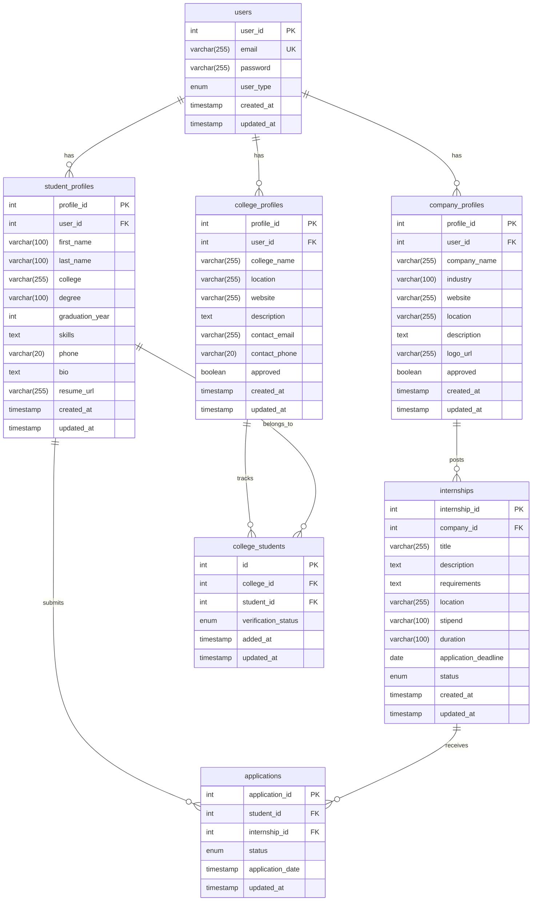

# Digital Internship & Placement Portal - Visual Schema Diagram

## Database Schema

## Table Constraints

### users
- Primary Key: user_id (auto-increment)
- Unique Key: email
- Check Constraint: user_type in ('student', 'company', 'college', 'admin')

### student_profiles
- Primary Key: profile_id (auto-increment)
- Foreign Key: user_id references users.user_id (cascade delete)

### company_profiles
- Primary Key: profile_id (auto-increment)
- Foreign Key: user_id references users.user_id (cascade delete)

### college_profiles
- Primary Key: profile_id (auto-increment)
- Foreign Key: user_id references users.user_id (cascade delete)

### internships
- Primary Key: internship_id (auto-increment)
- Foreign Key: company_id references company_profiles.profile_id (cascade delete)
- Check Constraint: status in ('open', 'closed', 'filled')

### applications
- Primary Key: application_id (auto-increment)
- Foreign Key: student_id references student_profiles.profile_id (cascade delete)
- Foreign Key: internship_id references internships.internship_id (cascade delete)
- Unique Constraint: (internship_id, student_id)
- Check Constraint: status in ('pending', 'shortlisted', 'rejected', 'selected')

### college_students
- Primary Key: id (auto-increment)
- Foreign Key: college_id references college_profiles.profile_id (cascade delete)
- Foreign Key: student_id references student_profiles.profile_id (cascade delete)
- Unique Constraint: (college_id, student_id)
- Check Constraint: verification_status in ('pending', 'verified', 'rejected')

---

*Note: This diagram uses Mermaid ER diagram syntax and can be rendered in compatible Markdown viewers or converted to an image using Mermaid tools.*
